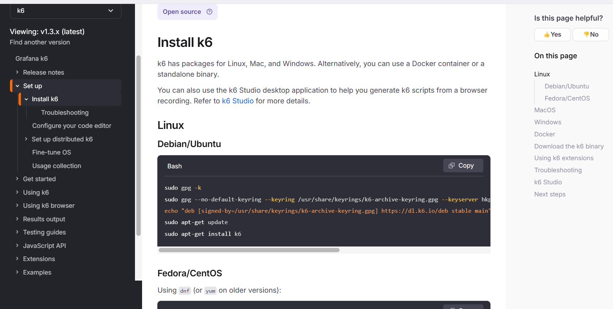
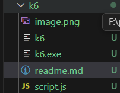
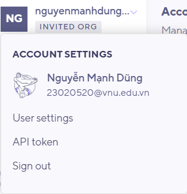
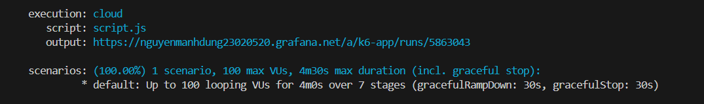

Cach chay chiu tai:
1,Dowload k6 tu web https://grafana.com/docs/k6/latest/set-up/install-k6/

2, luu file chua k6.exe vao project

3,Chay test script.js:
+cd vao folder luu k6.exe
+chay lenh ./k6.exe run script.js neu muon chay local 

- neu muon chay tren clound:
+tai ngrok 
+go len ngrok tren cmd 5001 voi 5001 la cong ma backend dang chay
+sau khi connect xong thi dang nhap tai khoan ca nhan tren cloud roi lay api token cua minh : 
+dang nhap tren terminal = lenh : ./k6.exe login cloud --token <your token>
+chay lenh  ./k6.exe cloud script.js de xem ket qua sau do terminal se hien ra duong dan: 